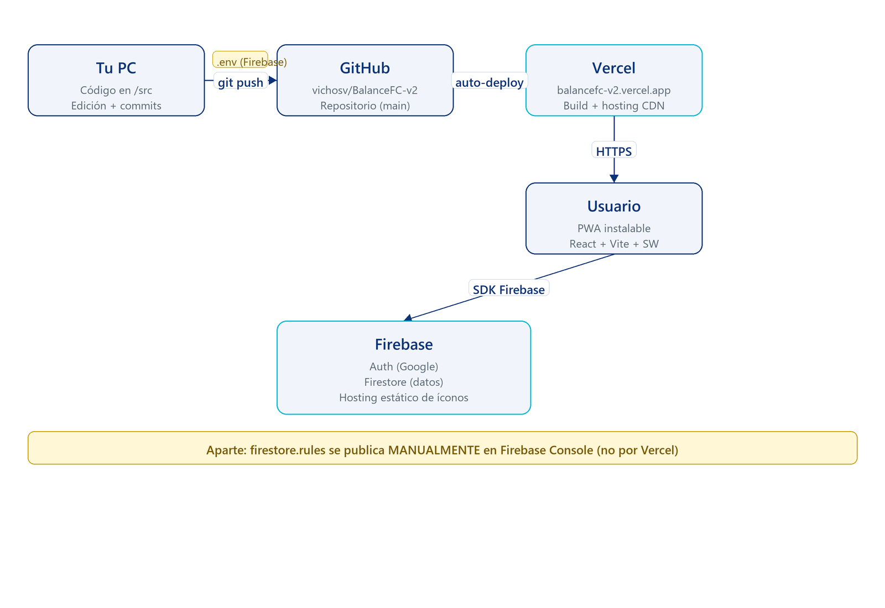

# BalanceFC — Arquitectura

App web para organizar fútbol de barrio: jugadores, equipos balanceados,
ranking, convocatorias, tienda cosmética y apuestas internas con monedas
("goles").

## Stack en una imagen



---

## 1. Dónde vive el código y cómo llega al usuario

| Pieza | Qué hace | Dónde |
|-------|----------|-------|
| **Código fuente** | React + Vite. Todo lo visual y la lógica del cliente. | Tu PC + GitHub (`vichosv/BalanceFC-v2`) |
| **GitHub** | Repositorio. Cada `git push` dispara un deploy. | `github.com/vichosv/BalanceFC-v2` |
| **Vercel** | Hostea la app. Compila el proyecto con `npm run build`, sirve los archivos estáticos y la PWA por HTTPS. | URL pública (`balancefc-v2.vercel.app` o similar) |
| **Firebase** | Backend gestionado. Auth + base de datos. Vive en tu cuenta de Google. | Consola Firebase (proyecto v2) |

**Flujo de despliegue:**
1. Editás archivos en `src/` (componentes React) o `firestore.rules`.
2. `git commit` + `git push` a `main`.
3. Vercel detecta el push, corre `npm install` + `npm run build`, y publica los assets nuevos.
4. Los usuarios reciben la versión nueva al recargar (la PWA además se auto-actualiza por el service worker).

**Las reglas de Firestore NO se deployan con Vercel.** Las tenés que publicar manualmente en la consola de Firebase (Firestore → Rules → pegar `firestore.rules` → Publish).

---

## 2. El frontend (React + Vite)

Aplicación SPA. Entrada en `src/main.jsx` → `App.jsx` → `MainLayout.jsx`
(decide qué pestaña mostrar según el estado `tab`).

```
src/
├─ pages/              ← Una por pestaña (HomePage, MatchPage, HistoryPage, etc.)
├─ components/         ← Reusables (PlayerCard, NavBar, EmptyState, modales)
├─ hooks/              ← Lógica de datos (useAuth, useMatches, useShopItems, useBets, etc.)
│                       Cada hook envuelve queries/snapshots de Firestore.
├─ utils/              ← Lógica pura (stats, logros, shop, challenges, teams)
└─ firebase/config.js  ← Credenciales del proyecto Firebase (vars de entorno)
```

**Patrones clave:**
- **Hooks de datos**: cada colección de Firestore tiene un hook con `onSnapshot` que mantiene los datos sincronizados en tiempo real (cualquier cambio en la DB se refleja al instante en todas las pantallas abiertas).
- **`ctx`**: en `MainLayout` se arma un objeto `ctx` con `user`, `isAdmin`, `players`, etc., y se pasa a cada página. Toggle "ver como jugador" se hace acá (anula `isAdmin` temporalmente).
- **PWA**: `vite-plugin-pwa` genera el service worker. El manifest (`favicon.svg` como ícono) hace que se pueda **instalar** en el celular y funcione **offline** (con la app cacheada; los datos siguen necesitando red).
- **Estilo**: Blue Lock — fondo hexagonal global + glassmorphism + animaciones (`fade-up`, `logo-glow`, `pulse-glow` en marcos).

---

## 3. Firebase: Auth + Firestore

**Firebase Auth** maneja el login con Google. Cada usuario logueado tiene un `uid` único.

**Firestore** es la base de datos NoSQL. Cada "colección" es una carpeta de documentos JSON. Estructura actual:

| Colección | Qué guarda |
|-----------|------------|
| `users/{uid}` | Auth-side: `isAdmin`, `onboarded`, `email`. Se crea en el onboarding. |
| `players/{uid}` | Perfil de juego: nickname, posición, foto, stats (vel/tec/def/tir/sta/fis), history (matches/wins/goals/assists), seasons, coins, inventory, equipped, statHistory, status. |
| `matches/{id}` | Cada partido jugado: teamA/B/C, scoreA/B/C, playerStats, votes, videoUrl, mvpAwardedUid, gkAwardedUid. |
| `seasons/{id}` | Temporadas: nombre, status (`active`/`closed`). |
| `convocatorias/{id}` | Próximos partidos: fecha, hora, lugar, confirmados[]. Se auto-borran cuando pasa la hora. |
| `shopItems/{id}` | Items custom de la tienda (los defaults están hardcodeados en `utils/shop.js`). Pueden sobreescribir defaults usando el mismo id. |
| `bets/{id}` | Apuestas: uid, tipo, monto, status (pending/won/lost). |
| `moments/{id}` | Momentos del partido (golazo/atajada/errado/blooper) con timestamp del video. |

Las **stats acumuladas** (history, seasons.*) y la **evolución de atributos** se actualizan automáticamente al guardar un partido — `useMatches.logMatch()` corre `buildStatUpdates`, `resolveBets` y `applyStatEvolution` en cascada.

---

## 4. Seguridad

**`firestore.rules`** es la única defensa: vive en Firebase y se ejecuta del lado del servidor. Sin reglas, cualquiera con el config del proyecto puede leer/escribir lo que sea.

Lo que **bloquean** las reglas actuales:
- Pumpear stats (vel/tec/def/...) o history.* → solo admin
- Hacerse admin a uno mismo (`isAdmin` field)
- Modificar otros jugadores, partidos, items de tienda, votos ajenos
- Borrar partidos/temporadas/items sin ser admin

Lo que **permiten** al jugador en su propio doc:
`nickname, position, photo, emoji, equipped, inventory, coins, claimedChallenges, status`

Trade-offs conocidos:
- El campo `coins` es self-writable (compras/apuestas/cajas funcionan client-side). Un usuario podría manipularlo. Mitigable con Cloud Functions más adelante.
- Cross-player coin transfer permitido (+1 exacto) para el award de MVP/Arquero.

---

## 5. Por qué cada pieza está donde está

- **Frontend en Vercel**: deploy automático, gratis hasta cierto tráfico, HTTPS automático, CDN global. La app es estática (SPA), no necesita servidor propio.
- **Firebase para datos**: tiempo real (snapshots), auth incluido, sin gestionar servidores ni bases. Free tier alcanza para grupos chicos.
- **PWA**: para que se sienta como app nativa en el celu (ícono en pantalla de inicio, splash, offline) sin pasar por App Store / Play Store.
- **Reglas como código**: `firestore.rules` versionado en git para tener historial y poder revisar cambios, aunque se deploya manualmente.

---

## 6. Archivos necesarios

Estos son los archivos que **no pueden faltar** para que la app corra y se deploye:

**Raíz del proyecto**
- `package.json` — declara las dependencias (React, Vite, Firebase, etc.) y los scripts (`dev`, `build`).
- `package-lock.json` — snapshot exacto de versiones (lo lee Vercel).
- `vite.config.js` — config de Vite + plugin PWA (genera el service worker y el manifest).
- `index.html` — punto de entrada HTML (incluye favicon, meta tags PWA y carga `main.jsx`).
- `firestore.rules` — reglas de seguridad de la DB (versionadas en git; se publican manualmente en Firebase Console).
- `.gitignore` — qué no se sube (node_modules, .env, dist).

**`public/`** (assets estáticos)
- `favicon.svg` — logo (tab del navegador, ícono PWA, hero, navbar).

**`src/`** (código fuente)
- `main.jsx` — entrada React, monta `<App />` + registra el SW.
- `App.jsx` — decide qué pantalla mostrar (login / onboarding / app).
- `index.css` — estilos globales (fondo hexagonal, animaciones, glass, etc.).
- `firebase/config.js` — config de Firebase leído desde variables de entorno.
- `pages/` — una página por pestaña (HomePage, MatchPage, etc.).
- `components/` — reusables (PlayerCard, NavBar, EmptyState, ErrorBoundary, Toast, etc.).
- `hooks/` — capa de datos (useAuth, useMatches, useShopItems, useBets, useMoments, etc.).
- `utils/` — lógica pura (stats, logros, shop, teams, challenges).

**Variables de entorno** (en Vercel y en `.env` local — no se suben a git)
```
VITE_FB_API_KEY=...
VITE_FB_AUTH_DOMAIN=...
VITE_FB_PROJECT_ID=...
VITE_FB_STORAGE_BUCKET=...
VITE_FB_MESSAGING_SENDER_ID=...
VITE_FB_APP_ID=...
```

**Generados automáticamente** (no se editan a mano):
- `dist/` — build de producción (lo genera `npm run build`, lo sirve Vercel).
- `node_modules/` — dependencias instaladas (gitignored).

---

## 7. Nuestro flujo de trabajo

**Para hacer cualquier cambio en la app:**

```
1.  Editar archivos en src/ (o firestore.rules, vite.config.js, etc.)
       │
2.  git add . && git commit -m "qué cambió"
       │
3.  git push origin main
       │
4.  Vercel detecta el push automáticamente:
       │   - corre npm install + npm run build
       │   - publica dist/ a la URL pública
       │   - tarda ~30-60s
       │
5.  Usuarios abren la app → la PWA detecta versión nueva → auto-update
       │
6.  Si tocaste firestore.rules → ENTRAR a Firebase Console:
       Firestore Database → Rules → pegar el archivo → Publish
```

**Atajos según qué cambiás:**

| Querés cambiar… | Tocás… | Cómo se publica |
|-----------------|--------|-----------------|
| UI, texto, layout | `src/pages/*` o `src/components/*` | git push → Vercel |
| Lógica / hooks | `src/hooks/*` o `src/utils/*` | git push → Vercel |
| Estilos globales | `src/index.css` | git push → Vercel |
| Reglas de seguridad | `firestore.rules` | **Manual**: Firebase Console → Rules → Publish |
| Defaults de la tienda | `src/utils/shop.js` (`DEFAULT_SHOP_ITEMS`) | git push → Vercel |
| Items custom de tienda | Desde la UI (admin → +Agregar / ✏️ editar) | Se guarda en Firestore en vivo, sin deploy |
| Logo / favicon | `public/favicon.svg` | git push → Vercel |
| Variables de Firebase | `.env` local y vars en Vercel | Re-deploy |

**Reglas de oro:**
- Si tocás `firestore.rules`, después tenés que **publicarlas a mano** en Firebase. Vercel no las toca.
- Los datos en Firestore (jugadores, partidos, items custom) **no se pierden** con un deploy — viven en Firebase, no en el código.
- El **commit a `main`** dispara el deploy. No hay paso de revisión ni branch staging configurado: lo que pushes va a producción.
- Si algo rompe la app, el **ErrorBoundary** muestra el mensaje del error en lugar de pantalla en blanco.

---

*Documento generado para BalanceFC v2 · stack: React 19 + Vite + Firebase + Vercel + PWA*
